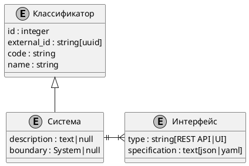

> Цифровая система - это информационная система для вычислительной обработки цифровых данных. 
{.is-info}

Информационная система - это ФС, поэтому и цифровая система является функциональной.

Взаимодействие внешней среды с ФС происходит на её границе (интерфейса), следовательно каждая ЦС обладает интерфейсом или интерфейсами.

