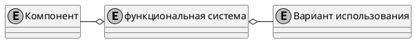

## Функциональная система

 > Функциональная система (фС) - это адаптивный комплекс избирательно вовлеченных [компонентов](/definitions/system-component), у которых взаимодействие и взаимоотношения принимают характер взаимосодействия компонентов на получение фокусированного полезного результата.
{.is-info}

Основные свойства функциональной системы:

1. функциональность
2. ценность
3. адаптивность

### Пояснение свойства 1. 

Функциональность означает определенное реагирование [системы](/definitions/system) на воздействие внешней среды. Причем результат реакций используются внешней средой для достижения определенной цели, а следовательно взаимодествие носит целенаправленный характер. Такие реакции системы назовем [функцией](/definitions/function). А все способы достижения определенного результата при взаимодействиии с ФС назовем [вариантом использования](/definitions/use-case).

Взаимодействие внешней среды с системой происходит на её границе, поэтому описание функциий ФС по своей сути есть описание ее границы.

### Пояснение свойства 2.

Совокупность функций, доступная внешней среде на границе ФС представляет собой ценность для внешней среды.

### Пояснение свойства 3.

Изменение системы происходит в сторону максимальной пользы системы (см свойство 4) при сохранении устойчивого равновесия. Вектор изменения определяется изменением отношения внешней среды к системе, а оно выражается в изменении потребности в использовании, изменении ее функций.

Функциональная система взаимодействует с внешней средой, а следовательно происходит обмен энергией. Для своего функционирования системе требуется энергия, то есть внутри системы происходит преобразование энергий. Потребитель функции системы передает ей энергию в обмен на результат функций системы.

> Подсистема - вполне самостоятельная часть системы, обладающая признаками системы.
{.is-info}

