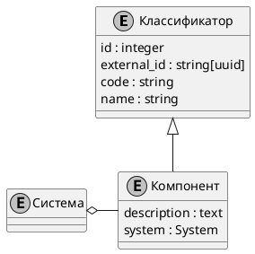

> Компонент - часть системы, вступающая в определенные отношения с другими частями (подсистемами, компонентами, элементами)
{.is-info}

```plantuml
@startuml

skinparam monochrome true
skinparam linetype ortho

entity "Классификатор" as Classifier {
	id : integer
	external_id : string[uuid]
	code : string
	name : string
}

entity "Система" as System {}

entity "Компонент" as Component {
	description : text
	system : System
}
Component -up-|> Classifier
System o-r- Component

@enduml
```