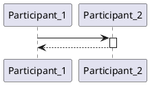
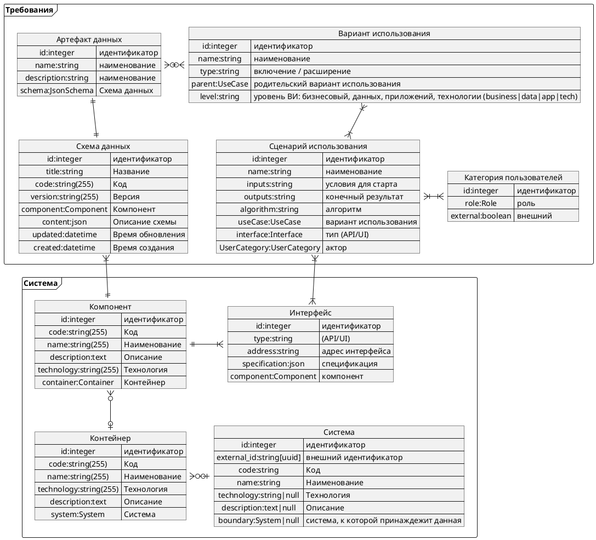

# КВИС

## Определения

Карта вариантов использования (КВИС) - инструмент управления требованиями к функциональной системе; управляет всей совокупностью вариантов использования ПО и категориями пользователей с учетом архитектуры ПО.
 
В КВИС совмещены лучшие практики системного анализа и дизайна. КВИС - расширение диаграммы вариантов использования, которое использует представление архитектуры ИС в формате С4 с дополнением уровня компонентов (С4) диаграммой компонентов. 

Каждый ВИ именован как как некоторое дейстиве над артефактом данных и распределен по пути пользователя (UJM). Каждому ВИ и элементу структуры ИС присваивается уникальный идентификатор специального вида. КВИС позволяет полноценного проектировать ИС распределяя функционал по многоуровневой структуре компонентов ИС. Это позволяет выявлять зависимости компонентов и выделять сами компоненты, обосновывая архитектуру. КВИС представляет собой описание функционала системы и его распределения по компонентам. 

КВИС может быть обогащен:

1. картами пути пользователя, что позволяет выявить ВИ и АРД на шагах пути пользователя конкретной категории пользователей
2. СИ в виде диаграмм взаиодействия, которые выявляют зависимости ВИ друг с другом и опосредовано компонентов
3. диаграммой компонентов, что расскрывает уровень компонентов в формате С4 углубляя понимание ответственности компонентов и детализируя ВИ в них
4. диаграммой потоков данных, что уточняет потоки АРД и обмен между компонентами, определяя состав и структуру данных интерфейсов компонентов
5. ER модели для детализации хранения АРД в хранилищах
6. ссылками на другие документы

## Назначение КВИС

- описание функционала ИС;
- определение ценности ИС для пользователей;
- определение категорий пользователей, взаимодействующих с ИС и взаимосвязи категорий пользователей и функционала;
- обнаружение совместно используемого функционала;
- отслеживание динамики изменения ценности ИС;
- отслеживание реализации функций;
- просмотр срезов по этапам изменения (текущее, целевое, на определенный момент);
- источник постановки задач на разработку;


Категория пользователей имеет одну цель или совокупность схожих целей, что и отличает одну КП от другой. По сути КП - это распределения целей, которые достигаются при использовании ФС.


## Применимость

КВИС применяется, если требования могут быть описаны [функциями ФС](/definitions/function), т.е. как определенную реакцию на взаимодействие внешней среды с целью получения полезного результата, причем это взаимодействие ограничено во времени и количество участников конечно. Такие ограничения позволяют сформулировать однозначные сценарии использования (СИ) для каждого ВИ. 

ВИ должен обладать свойством полной транзакции, т.е. завершаться получением определенного результата либо завершаться сбросом всех изменений.

Сценарий использования (СИ) - это описание (транзакции взаимодействия внешней среды с ФС) последовательности действий акторов и реакций ФС с целью получения полезного результата.

Сценарий использования всегда может быть  представлен в виде диаграммы последовательности.

СИ оформляется как матрица обмена сообщениями между участника взаимодействия. По горизонтали - участники взаимодействия, по вертикали - время, Вдоль вертикали у каждого участника располагается время его активности.



## ВИ как функция ФС

ВИ представим [функцией ФС](/definitions/function), у которой входными параметрами являются ~~параметры~~ пользователя **u** и систояние системы **s**, выходом является результат **r**, алгоритмом явлется СИ A.

```diagram
PHN2ZyB4bWxucz0iaHR0cDovL3d3dy53My5vcmcvMjAwMC9zdmciIHN0eWxlPSJiYWNrZ3JvdW5kOiB0cmFuc3BhcmVudDsgYmFja2dyb3VuZC1jb2xvcjogdHJhbnNwYXJlbnQ7IiB4bWxuczp4bGluaz0iaHR0cDovL3d3dy53My5vcmcvMTk5OS94bGluayIgdmVyc2lvbj0iMS4xIiB3aWR0aD0iNTYxcHgiIGhlaWdodD0iMzAxcHgiIHZpZXdCb3g9Ii0wLjUgLTAuNSA1NjEgMzAxIiBjb250ZW50PSImbHQ7bXhmaWxlIGhvc3Q9JnF1b3Q7ZW1iZWQuZGlhZ3JhbXMubmV0JnF1b3Q7IGFnZW50PSZxdW90O01vemlsbGEvNS4wIChXaW5kb3dzIE5UIDEwLjA7IFdpbjY0OyB4NjQpIEFwcGxlV2ViS2l0LzUzNy4zNiAoS0hUTUwsIGxpa2UgR2Vja28pIENocm9tZS8xMzcuMC4wLjAgU2FmYXJpLzUzNy4zNiZxdW90OyB2ZXJzaW9uPSZxdW90OzI3LjEuNiZxdW90OyZndDsmbHQ7ZGlhZ3JhbSBpZD0mcXVvdDt0WkE3c0o2ZEdndG9taUx4LXE2diZxdW90OyBuYW1lPSZxdW90O9Ch0YLRgNCw0L3QuNGG0LAg4oCUIDEmcXVvdDsmZ3Q7elZoTmM2TWdHUDQxSHROQmlZazV4alR0SHJvem5lbGh6MVNKc3FQaUlEWkpmLzJDZ2dZeHJkUFkyVjRzUHNBclBNLzcxVGh3bDU4ZUdTclQzelRHbWVPQitPVEFlOGZ6M0FBdXhSK0puRnRrRlNnZ1lTUldpM3JnaGJ4akJRS0YxaVRHbGJHUVU1cHhVcHBnUklzQ1I5ekFFR1AwYUM0NzBNejhhb2tTYkFFdkVjcHM5QStKZWRxaWdiZnU4VitZSktuK3NydmF0RE01MG91VmlTcEZNVDIyVUhNNXVIZmdqbEhLMjFGKzJ1Rk1rcWQ1YVJsNHVETGJIWXpoZ2svYW9IYThvYXhXbDFNSDQyZDlXN0ZERUN0ZXdtTktPSDRwVVNSbmprSmJnYVU4ejhTYks0YjJ4N1YxekRnK1hVRHFNSStZNXBpenMxaWlaMTNGbFBJTVY1MGZISHVlL1pYQzBndU9JVkFnVXRvbW5lMysrbUtnR0xqQ0JyQXZId3ZsMVN0bFBLVUpMVkMyNzlHUTBicUlzYlFBeEZ1LzVvblNVaEh6RjNOK1ZtNk1hazRuMGxiUm1rWHFIRW9XamxpQzFTckZsRHpoaDlReW5DRk8za3pmdlltbXBlVTBiSlM0Si9RcUl0KzRMTXBJVW9oeEpDNkxtUUNrYnhBUldsczFrWk00Ym5uRkZYbEhyNDA5eVd4SlNjR2JVL3VoNDkrUEV3ZXVPRnlYQzVSQkk5ekdIQkhjQWVnRzdkYkpCQ3Byei9La3ZhbUZaN2owSWpBTjBNT2hFcElPK2UrT05Fa1N6MUprYXlueVNmU2lxbXh6NVlHY3BEdlBFYzV3dlRUdTdvR1JjQjZKWm4rR1lJWVRNbHNSYjJVNWtQNllvYW9pa1VtSkdkcVQ0blJweDZrM01VNG5jbktqTjNvNmUycEpQTjgwMGQ1Rzdib3NIVU5EWUdBSURrUnJPYkFNZmNHN1hkdTk2NStSY0xTVDNaeHZGdURPOVNHY1JXTC8rL09OWFFFY3dkbm1RVDdEZmZNTUhjRi9zR3ZHNnd1OFdSbUNacllkKzhiNm9hNmlSU3Jsc002emJjVHBwWVNOM00rMElweFFLZVVyNVp6bUl4cHpPa2gydE9ZWktmQ3VheEEvRFBEcENhOExBdDIvYkh3cjRjR1I0RjdOa1BEOGNVMEMrZHk2RnE5bWN2disxZzVDczdXRHJsMEx1blp2Ym01Vy82VVkrRCs5R01CQk1ZRER3anUxR0N3SGhkNHlOR014c0F0NzlUT0tnWGF5V1lvQmRQMVpKRjZzekdvd01EQkxOZGlNWnA0dHVNanU2eWE3UTdNeWRCVkFWNE5ydVQvRko1VElGQitXbUJGeE1pbWVScDgxNUgyZXg1cmVWdjBuTmxOZVcyNEdmZEJJanp1YTE3N1E1SXJYL3JlQlZxaitGeGE0L3djPSZsdDsvZGlhZ3JhbSZndDsmbHQ7L214ZmlsZSZndDsiPjxkZWZzPjxzdHlsZSB4bWxucz0iaHR0cDovL3d3dy53My5vcmcvMTk5OS94aHRtbCIgaWQ9Ik1KWC1TVkctc3R5bGVzIj4mI3hhO21qeC1jb250YWluZXJbamF4PSJTVkciXSB7JiN4YTsgIGRpcmVjdGlvbjogbHRyOyYjeGE7fSYjeGE7JiN4YTttangtY29udGFpbmVyW2pheD0iU1ZHIl0gJmd0OyBzdmcgeyYjeGE7ICBvdmVyZmxvdzogdmlzaWJsZTsmI3hhOyAgbWluLWhlaWdodDogMXB4OyYjeGE7ICBtaW4td2lkdGg6IDFweDsmI3hhO30mI3hhOyYjeGE7bWp4LWNvbnRhaW5lcltqYXg9IlNWRyJdICZndDsgc3ZnIGEgeyYjeGE7ICBmaWxsOiBibHVlOyYjeGE7ICBzdHJva2U6IGJsdWU7JiN4YTt9JiN4YTsmI3hhO21qeC1jb250YWluZXJbamF4PSJTVkciXVtkaXNwbGF5PSJ0cnVlIl0geyYjeGE7ICBkaXNwbGF5OiBibG9jazsmI3hhOyAgdGV4dC1hbGlnbjogY2VudGVyOyYjeGE7ICBtYXJnaW46IDFlbSAwOyYjeGE7fSYjeGE7JiN4YTttangtY29udGFpbmVyW2pheD0iU1ZHIl1bZGlzcGxheT0idHJ1ZSJdW3dpZHRoPSJmdWxsIl0geyYjeGE7ICBkaXNwbGF5OiBmbGV4OyYjeGE7fSYjeGE7JiN4YTttangtY29udGFpbmVyW2pheD0iU1ZHIl1banVzdGlmeT0ibGVmdCJdIHsmI3hhOyAgdGV4dC1hbGlnbjogbGVmdDsmI3hhO30mI3hhOyYjeGE7bWp4LWNvbnRhaW5lcltqYXg9IlNWRyJdW2p1c3RpZnk9InJpZ2h0Il0geyYjeGE7ICB0ZXh0LWFsaWduOiByaWdodDsmI3hhO30mI3hhOyYjeGE7Z1tkYXRhLW1tbC1ub2RlPSJtZXJyb3IiXSAmZ3Q7IGcgeyYjeGE7ICBmaWxsOiByZWQ7JiN4YTsgIHN0cm9rZTogcmVkOyYjeGE7fSYjeGE7JiN4YTtnW2RhdGEtbW1sLW5vZGU9Im1lcnJvciJdICZndDsgcmVjdFtkYXRhLWJhY2tncm91bmRdIHsmI3hhOyAgZmlsbDogeWVsbG93OyYjeGE7ICBzdHJva2U6IG5vbmU7JiN4YTt9JiN4YTsmI3hhO2dbZGF0YS1tbWwtbm9kZT0ibXRhYmxlIl0gJmd0OyBsaW5lW2RhdGEtbGluZV0sIHN2Z1tkYXRhLXRhYmxlXSAmZ3Q7IGcgJmd0OyBsaW5lW2RhdGEtbGluZV0geyYjeGE7ICBzdHJva2Utd2lkdGg6IDcwcHg7JiN4YTsgIGZpbGw6IG5vbmU7JiN4YTt9JiN4YTsmI3hhO2dbZGF0YS1tbWwtbm9kZT0ibXRhYmxlIl0gJmd0OyByZWN0W2RhdGEtZnJhbWVdLCBzdmdbZGF0YS10YWJsZV0gJmd0OyBnICZndDsgcmVjdFtkYXRhLWZyYW1lXSB7JiN4YTsgIHN0cm9rZS13aWR0aDogNzBweDsmI3hhOyAgZmlsbDogbm9uZTsmI3hhO30mI3hhOyYjeGE7Z1tkYXRhLW1tbC1ub2RlPSJtdGFibGUiXSAmZ3Q7IC5tangtZGFzaGVkLCBzdmdbZGF0YS10YWJsZV0gJmd0OyBnICZndDsgLm1qeC1kYXNoZWQgeyYjeGE7ICBzdHJva2UtZGFzaGFycmF5OiAxNDA7JiN4YTt9JiN4YTsmI3hhO2dbZGF0YS1tbWwtbm9kZT0ibXRhYmxlIl0gJmd0OyAubWp4LWRvdHRlZCwgc3ZnW2RhdGEtdGFibGVdICZndDsgZyAmZ3Q7IC5tangtZG90dGVkIHsmI3hhOyAgc3Ryb2tlLWxpbmVjYXA6IHJvdW5kOyYjeGE7ICBzdHJva2UtZGFzaGFycmF5OiAwLDE0MDsmI3hhO30mI3hhOyYjeGE7Z1tkYXRhLW1tbC1ub2RlPSJtdGFibGUiXSAmZ3Q7IGcgJmd0OyBzdmcgeyYjeGE7ICBvdmVyZmxvdzogdmlzaWJsZTsmI3hhO30mI3hhOyYjeGE7W2pheD0iU1ZHIl0gbWp4LXRvb2wgeyYjeGE7ICBkaXNwbGF5OiBpbmxpbmUtYmxvY2s7JiN4YTsgIHBvc2l0aW9uOiByZWxhdGl2ZTsmI3hhOyAgd2lkdGg6IDA7JiN4YTsgIGhlaWdodDogMDsmI3hhO30mI3hhOyYjeGE7W2pheD0iU1ZHIl0gbWp4LXRvb2wgJmd0OyBtangtdGlwIHsmI3hhOyAgcG9zaXRpb246IGFic29sdXRlOyYjeGE7ICB0b3A6IDA7JiN4YTsgIGxlZnQ6IDA7JiN4YTt9JiN4YTsmI3hhO21qeC10b29sICZndDsgbWp4LXRpcCB7JiN4YTsgIGRpc3BsYXk6IGlubGluZS1ibG9jazsmI3hhOyAgcGFkZGluZzogLjJlbTsmI3hhOyAgYm9yZGVyOiAxcHggc29saWQgIzg4ODsmI3hhOyAgZm9udC1zaXplOiA3MCU7JiN4YTsgIGJhY2tncm91bmQtY29sb3I6ICNGOEY4Rjg7JiN4YTsgIGNvbG9yOiBibGFjazsmI3hhOyAgYm94LXNoYWRvdzogMnB4IDJweCA1cHggI0FBQUFBQTsmI3hhO30mI3hhOyYjeGE7Z1tkYXRhLW1tbC1ub2RlPSJtYWN0aW9uIl1bZGF0YS10b2dnbGVdIHsmI3hhOyAgY3Vyc29yOiBwb2ludGVyOyYjeGE7fSYjeGE7JiN4YTttangtc3RhdHVzIHsmI3hhOyAgZGlzcGxheTogYmxvY2s7JiN4YTsgIHBvc2l0aW9uOiBmaXhlZDsmI3hhOyAgbGVmdDogMWVtOyYjeGE7ICBib3R0b206IDFlbTsmI3hhOyAgbWluLXdpZHRoOiAyNSU7JiN4YTsgIHBhZGRpbmc6IC4yZW0gLjRlbTsmI3hhOyAgYm9yZGVyOiAxcHggc29saWQgIzg4ODsmI3hhOyAgZm9udC1zaXplOiA5MCU7JiN4YTsgIGJhY2tncm91bmQtY29sb3I6ICNGOEY4Rjg7JiN4YTsgIGNvbG9yOiBibGFjazsmI3hhO30mI3hhOyYjeGE7Zm9yZWlnbk9iamVjdFtkYXRhLW1qeC14bWxdIHsmI3hhOyAgZm9udC1mYW1pbHk6IGluaXRpYWw7JiN4YTsgIGxpbmUtaGVpZ2h0OiBub3JtYWw7JiN4YTsgIG92ZXJmbG93OiB2aXNpYmxlOyYjeGE7fSYjeGE7JiN4YTttangtY29udGFpbmVyW2pheD0iU1ZHIl0gcGF0aFtkYXRhLWNdLCBtangtY29udGFpbmVyW2pheD0iU1ZHIl0gdXNlW2RhdGEtY10geyYjeGE7ICBzdHJva2Utd2lkdGg6IDM7JiN4YTt9JiN4YTs8L3N0eWxlPjwvZGVmcz48Zz48ZyBkYXRhLWNlbGwtaWQ9IjAiPjxnIGRhdGEtY2VsbC1pZD0iMSI+PGcgZGF0YS1jZWxsLWlkPSIxMSI+PGc+PGVsbGlwc2UgY3g9IjI4MCIgY3k9IjE1MCIgcng9IjI4MCIgcnk9IjE1MCIgZmlsbD0iI2ZmZmZmZiIgc3Ryb2tlPSIjMDAwMDAwIiBwb2ludGVyLWV2ZW50cz0iYWxsIiBzdHlsZT0iZmlsbDogbGlnaHQtZGFyaygjZmZmZmZmLCB2YXIoLS1nZS1kYXJrLWNvbG9yLCAjMTIxMjEyKSk7IHN0cm9rZTogbGlnaHQtZGFyayhyZ2IoMCwgMCwgMCksIHJnYigyNTUsIDI1NSwgMjU1KSk7Ii8+PC9nPjwvZz48ZyBkYXRhLWNlbGwtaWQ9IjEwIj48Zz48cGF0aCBkPSJNIDMwNSAxMDUgTCAzNjQuNjMgMTA1IiBmaWxsPSJub25lIiBzdHJva2U9IiMwMDAwMDAiIHN0cm9rZS1taXRlcmxpbWl0PSIxMCIgcG9pbnRlci1ldmVudHM9InN0cm9rZSIgc3R5bGU9InN0cm9rZTogbGlnaHQtZGFyayhyZ2IoMCwgMCwgMCksIHJnYigyNTUsIDI1NSwgMjU1KSk7Ii8+PHBhdGggZD0iTSAzNjkuODggMTA1IEwgMzYyLjg4IDEwOC41IEwgMzY0LjYzIDEwNSBMIDM2Mi44OCAxMDEuNSBaIiBmaWxsPSIjMDAwMDAwIiBzdHJva2U9IiMwMDAwMDAiIHN0cm9rZS1taXRlcmxpbWl0PSIxMCIgcG9pbnRlci1ldmVudHM9ImFsbCIgc3R5bGU9ImZpbGw6IGxpZ2h0LWRhcmsocmdiKDAsIDAsIDApLCByZ2IoMjU1LCAyNTUsIDI1NSkpOyBzdHJva2U6IGxpZ2h0LWRhcmsocmdiKDAsIDAsIDApLCByZ2IoMjU1LCAyNTUsIDI1NSkpOyIvPjwvZz48ZyBkYXRhLWNlbGwtaWQ9IjE0Ij48Zz48ZyB0cmFuc2Zvcm09InRyYW5zbGF0ZSgtMC41IC0wLjUpIj48c3dpdGNoPjxmb3JlaWduT2JqZWN0IHN0eWxlPSJvdmVyZmxvdzogdmlzaWJsZTsgdGV4dC1hbGlnbjogbGVmdDsiIHBvaW50ZXItZXZlbnRzPSJub25lIiB3aWR0aD0iMTAwJSIgaGVpZ2h0PSIxMDAlIiByZXF1aXJlZEZlYXR1cmVzPSJodHRwOi8vd3d3LnczLm9yZy9UUi9TVkcxMS9mZWF0dXJlI0V4dGVuc2liaWxpdHkiPjxkaXYgeG1sbnM9Imh0dHA6Ly93d3cudzMub3JnLzE5OTkveGh0bWwiIHN0eWxlPSJkaXNwbGF5OiBmbGV4OyBhbGlnbi1pdGVtczogdW5zYWZlIGNlbnRlcjsganVzdGlmeS1jb250ZW50OiB1bnNhZmUgY2VudGVyOyB3aWR0aDogMXB4OyBoZWlnaHQ6IDFweDsgcGFkZGluZy10b3A6IDk4cHg7IG1hcmdpbi1sZWZ0OiAzMzhweDsiPjxkaXYgc3R5bGU9ImJveC1zaXppbmc6IGJvcmRlci1ib3g7IGZvbnQtc2l6ZTogMDsgdGV4dC1hbGlnbjogY2VudGVyOyBjb2xvcjogIzAwMDAwMDsgYmFja2dyb3VuZC1jb2xvcjogI2ZmZmZmZjsgIj48ZGl2IHN0eWxlPSJkaXNwbGF5OiBpbmxpbmUtYmxvY2s7IGZvbnQtc2l6ZTogMTFweDsgZm9udC1mYW1pbHk6ICZxdW90O0hlbHZldGljYSZxdW90OzsgY29sb3I6IGxpZ2h0LWRhcmsoIzAwMDAwMCwgI2ZmZmZmZik7IGxpbmUtaGVpZ2h0OiAxLjI7IHBvaW50ZXItZXZlbnRzOiBhbGw7IGJhY2tncm91bmQtY29sb3I6IGxpZ2h0LWRhcmsoI2ZmZmZmZiwgdmFyKC0tZ2UtZGFyay1jb2xvciwgIzEyMTIxMikpOyB3aGl0ZS1zcGFjZTogbm93cmFwOyAiPnI8L2Rpdj48L2Rpdj48L2Rpdj48L2ZvcmVpZ25PYmplY3Q+PHRleHQgeD0iMzM4IiB5PSIxMDEiIGZpbGw9ImxpZ2h0LWRhcmsoIzAwMDAwMCwgI2ZmZmZmZikiIGZvbnQtZmFtaWx5PSImcXVvdDtIZWx2ZXRpY2EmcXVvdDsiIGZvbnQtc2l6ZT0iMTFweCIgdGV4dC1hbmNob3I9Im1pZGRsZSI+cjwvdGV4dD48L3N3aXRjaD48L2c+PC9nPjwvZz48L2c+PGcgZGF0YS1jZWxsLWlkPSIyIj48Zz48cmVjdCB4PSIyNTUiIHk9IjgwIiB3aWR0aD0iNTAiIGhlaWdodD0iNTAiIGZpbGw9IiNmZmZmZmYiIHN0cm9rZT0iIzAwMDAwMCIgcG9pbnRlci1ldmVudHM9ImFsbCIgc3R5bGU9ImZpbGw6IGxpZ2h0LWRhcmsoI2ZmZmZmZiwgdmFyKC0tZ2UtZGFyay1jb2xvciwgIzEyMTIxMikpOyBzdHJva2U6IGxpZ2h0LWRhcmsocmdiKDAsIDAsIDApLCByZ2IoMjU1LCAyNTUsIDI1NSkpOyIvPjwvZz48Zz48ZyB0cmFuc2Zvcm09InRyYW5zbGF0ZSgtMC41IC0wLjUpIj48c3dpdGNoPjxmb3JlaWduT2JqZWN0IHN0eWxlPSJvdmVyZmxvdzogdmlzaWJsZTsgdGV4dC1hbGlnbjogbGVmdDsiIHBvaW50ZXItZXZlbnRzPSJub25lIiB3aWR0aD0iMTAwJSIgaGVpZ2h0PSIxMDAlIiByZXF1aXJlZEZlYXR1cmVzPSJodHRwOi8vd3d3LnczLm9yZy9UUi9TVkcxMS9mZWF0dXJlI0V4dGVuc2liaWxpdHkiPjxkaXYgeG1sbnM9Imh0dHA6Ly93d3cudzMub3JnLzE5OTkveGh0bWwiIHN0eWxlPSJkaXNwbGF5OiBmbGV4OyBhbGlnbi1pdGVtczogdW5zYWZlIGNlbnRlcjsganVzdGlmeS1jb250ZW50OiB1bnNhZmUgY2VudGVyOyB3aWR0aDogNDhweDsgaGVpZ2h0OiAxcHg7IHBhZGRpbmctdG9wOiAxMDVweDsgbWFyZ2luLWxlZnQ6IDI1NnB4OyI+PGRpdiBzdHlsZT0iYm94LXNpemluZzogYm9yZGVyLWJveDsgZm9udC1zaXplOiAwOyB0ZXh0LWFsaWduOiBjZW50ZXI7IGNvbG9yOiAjMDAwMDAwOyAiPjxkaXYgc3R5bGU9ImRpc3BsYXk6IGlubGluZS1ibG9jazsgZm9udC1zaXplOiAxMnB4OyBmb250LWZhbWlseTogJnF1b3Q7SGVsdmV0aWNhJnF1b3Q7OyBjb2xvcjogbGlnaHQtZGFyaygjMDAwMDAwLCAjZmZmZmZmKTsgbGluZS1oZWlnaHQ6IDEuMjsgcG9pbnRlci1ldmVudHM6IGFsbDsgd2hpdGUtc3BhY2U6IG5vcm1hbDsgd29yZC13cmFwOiBub3JtYWw7ICI+QTwvZGl2PjwvZGl2PjwvZGl2PjwvZm9yZWlnbk9iamVjdD48dGV4dCB4PSIyODAiIHk9IjEwOSIgZmlsbD0ibGlnaHQtZGFyaygjMDAwMDAwLCAjZmZmZmZmKSIgZm9udC1mYW1pbHk9IiZxdW90O0hlbHZldGljYSZxdW90OyIgZm9udC1zaXplPSIxMnB4IiB0ZXh0LWFuY2hvcj0ibWlkZGxlIj5BPC90ZXh0Pjwvc3dpdGNoPjwvZz48L2c+PC9nPjxnIGRhdGEtY2VsbC1pZD0iMyI+PGc+PHBhdGggZD0iTSAxNDEgMTA1IEwgMjQ4LjYzIDEwNSIgZmlsbD0ibm9uZSIgc3Ryb2tlPSIjMDAwMDAwIiBzdHJva2UtbWl0ZXJsaW1pdD0iMTAiIHBvaW50ZXItZXZlbnRzPSJzdHJva2UiIHN0eWxlPSJzdHJva2U6IGxpZ2h0LWRhcmsocmdiKDAsIDAsIDApLCByZ2IoMjU1LCAyNTUsIDI1NSkpOyIvPjxwYXRoIGQ9Ik0gMjUzLjg4IDEwNSBMIDI0Ni44OCAxMDguNSBMIDI0OC42MyAxMDUgTCAyNDYuODggMTAxLjUgWiIgZmlsbD0iIzAwMDAwMCIgc3Ryb2tlPSIjMDAwMDAwIiBzdHJva2UtbWl0ZXJsaW1pdD0iMTAiIHBvaW50ZXItZXZlbnRzPSJhbGwiIHN0eWxlPSJmaWxsOiBsaWdodC1kYXJrKHJnYigwLCAwLCAwKSwgcmdiKDI1NSwgMjU1LCAyNTUpKTsgc3Ryb2tlOiBsaWdodC1kYXJrKHJnYigwLCAwLCAwKSwgcmdiKDI1NSwgMjU1LCAyNTUpKTsiLz48L2c+PGcgZGF0YS1jZWxsLWlkPSIxMiI+PGc+PGcgdHJhbnNmb3JtPSJ0cmFuc2xhdGUoLTAuNSAtMC41KSI+PHN3aXRjaD48Zm9yZWlnbk9iamVjdCBzdHlsZT0ib3ZlcmZsb3c6IHZpc2libGU7IHRleHQtYWxpZ246IGxlZnQ7IiBwb2ludGVyLWV2ZW50cz0ibm9uZSIgd2lkdGg9IjEwMCUiIGhlaWdodD0iMTAwJSIgcmVxdWlyZWRGZWF0dXJlcz0iaHR0cDovL3d3dy53My5vcmcvVFIvU1ZHMTEvZmVhdHVyZSNFeHRlbnNpYmlsaXR5Ij48ZGl2IHhtbG5zPSJodHRwOi8vd3d3LnczLm9yZy8xOTk5L3hodG1sIiBzdHlsZT0iZGlzcGxheTogZmxleDsgYWxpZ24taXRlbXM6IHVuc2FmZSBjZW50ZXI7IGp1c3RpZnktY29udGVudDogdW5zYWZlIGNlbnRlcjsgd2lkdGg6IDFweDsgaGVpZ2h0OiAxcHg7IHBhZGRpbmctdG9wOiA5OHB4OyBtYXJnaW4tbGVmdDogMTk1cHg7Ij48ZGl2IHN0eWxlPSJib3gtc2l6aW5nOiBib3JkZXItYm94OyBmb250LXNpemU6IDA7IHRleHQtYWxpZ246IGNlbnRlcjsgY29sb3I6ICMwMDAwMDA7IGJhY2tncm91bmQtY29sb3I6ICNmZmZmZmY7ICI+PGRpdiBzdHlsZT0iZGlzcGxheTogaW5saW5lLWJsb2NrOyBmb250LXNpemU6IDExcHg7IGZvbnQtZmFtaWx5OiAmcXVvdDtIZWx2ZXRpY2EmcXVvdDs7IGNvbG9yOiBsaWdodC1kYXJrKCMwMDAwMDAsICNmZmZmZmYpOyBsaW5lLWhlaWdodDogMS4yOyBwb2ludGVyLWV2ZW50czogYWxsOyBiYWNrZ3JvdW5kLWNvbG9yOiBsaWdodC1kYXJrKCNmZmZmZmYsIHZhcigtLWdlLWRhcmstY29sb3IsICMxMjEyMTIpKTsgd2hpdGUtc3BhY2U6IG5vd3JhcDsgIj51PC9kaXY+PC9kaXY+PC9kaXY+PC9mb3JlaWduT2JqZWN0Pjx0ZXh0IHg9IjE5NSIgeT0iMTAxIiBmaWxsPSJsaWdodC1kYXJrKCMwMDAwMDAsICNmZmZmZmYpIiBmb250LWZhbWlseT0iJnF1b3Q7SGVsdmV0aWNhJnF1b3Q7IiBmb250LXNpemU9IjExcHgiIHRleHQtYW5jaG9yPSJtaWRkbGUiPnU8L3RleHQ+PC9zd2l0Y2g+PC9nPjwvZz48L2c+PC9nPjxnIGRhdGEtY2VsbC1pZD0iNCI+PGc+PGVsbGlwc2UgY3g9IjEyNiIgY3k9IjgyLjUiIHJ4PSI3LjUiIHJ5PSI3LjUiIGZpbGw9IiNmZmZmZmYiIHN0cm9rZT0iIzAwMDAwMCIgcG9pbnRlci1ldmVudHM9ImFsbCIgc3R5bGU9ImZpbGw6IGxpZ2h0LWRhcmsoI2ZmZmZmZiwgdmFyKC0tZ2UtZGFyay1jb2xvciwgIzEyMTIxMikpOyBzdHJva2U6IGxpZ2h0LWRhcmsocmdiKDAsIDAsIDApLCByZ2IoMjU1LCAyNTUsIDI1NSkpOyIvPjxwYXRoIGQ9Ik0gMTI2IDkwIEwgMTI2IDExNSBNIDEyNiA5NSBMIDExMSA5NSBNIDEyNiA5NSBMIDE0MSA5NSBNIDEyNiAxMTUgTCAxMTEgMTM1IE0gMTI2IDExNSBMIDE0MSAxMzUiIGZpbGw9Im5vbmUiIHN0cm9rZT0iIzAwMDAwMCIgc3Ryb2tlLW1pdGVybGltaXQ9IjEwIiBwb2ludGVyLWV2ZW50cz0iYWxsIiBzdHlsZT0ic3Ryb2tlOiBsaWdodC1kYXJrKHJnYigwLCAwLCAwKSwgcmdiKDI1NSwgMjU1LCAyNTUpKTsiLz48L2c+PGc+PGcgdHJhbnNmb3JtPSJ0cmFuc2xhdGUoLTAuNSAtMC41KSI+PHN3aXRjaD48Zm9yZWlnbk9iamVjdCBzdHlsZT0ib3ZlcmZsb3c6IHZpc2libGU7IHRleHQtYWxpZ246IGxlZnQ7IiBwb2ludGVyLWV2ZW50cz0ibm9uZSIgd2lkdGg9IjEwMCUiIGhlaWdodD0iMTAwJSIgcmVxdWlyZWRGZWF0dXJlcz0iaHR0cDovL3d3dy53My5vcmcvVFIvU1ZHMTEvZmVhdHVyZSNFeHRlbnNpYmlsaXR5Ij48ZGl2IHhtbG5zPSJodHRwOi8vd3d3LnczLm9yZy8xOTk5L3hodG1sIiBzdHlsZT0iZGlzcGxheTogZmxleDsgYWxpZ24taXRlbXM6IHVuc2FmZSBmbGV4LXN0YXJ0OyBqdXN0aWZ5LWNvbnRlbnQ6IHVuc2FmZSBjZW50ZXI7IHdpZHRoOiAxcHg7IGhlaWdodDogMXB4OyBwYWRkaW5nLXRvcDogMTQycHg7IG1hcmdpbi1sZWZ0OiAxMjZweDsiPjxkaXYgc3R5bGU9ImJveC1zaXppbmc6IGJvcmRlci1ib3g7IGZvbnQtc2l6ZTogMDsgdGV4dC1hbGlnbjogY2VudGVyOyBjb2xvcjogIzAwMDAwMDsgIj48ZGl2IHN0eWxlPSJkaXNwbGF5OiBpbmxpbmUtYmxvY2s7IGZvbnQtc2l6ZTogMTJweDsgZm9udC1mYW1pbHk6ICZxdW90O0hlbHZldGljYSZxdW90OzsgY29sb3I6IGxpZ2h0LWRhcmsoIzAwMDAwMCwgI2ZmZmZmZik7IGxpbmUtaGVpZ2h0OiAxLjI7IHBvaW50ZXItZXZlbnRzOiBhbGw7IHdoaXRlLXNwYWNlOiBub3dyYXA7ICI+0J/QvtC70YzQt9C+0LLQsNGC0LXQu9GMPC9kaXY+PC9kaXY+PC9kaXY+PC9mb3JlaWduT2JqZWN0Pjx0ZXh0IHg9IjEyNiIgeT0iMTU0IiBmaWxsPSJsaWdodC1kYXJrKCMwMDAwMDAsICNmZmZmZmYpIiBmb250LWZhbWlseT0iJnF1b3Q7SGVsdmV0aWNhJnF1b3Q7IiBmb250LXNpemU9IjEycHgiIHRleHQtYW5jaG9yPSJtaWRkbGUiPtCf0L7Qu9GM0LfQvtCy0LDRgtC10LvRjDwvdGV4dD48L3N3aXRjaD48L2c+PC9nPjwvZz48ZyBkYXRhLWNlbGwtaWQ9IjUiPjxnPjxyZWN0IHg9IjIyMCIgeT0iMTkwIiB3aWR0aD0iMTIwIiBoZWlnaHQ9IjYwIiBmaWxsPSIjZmZmZmZmIiBzdHJva2U9IiMwMDAwMDAiIHBvaW50ZXItZXZlbnRzPSJhbGwiIHN0eWxlPSJmaWxsOiBsaWdodC1kYXJrKCNmZmZmZmYsIHZhcigtLWdlLWRhcmstY29sb3IsICMxMjEyMTIpKTsgc3Ryb2tlOiBsaWdodC1kYXJrKHJnYigwLCAwLCAwKSwgcmdiKDI1NSwgMjU1LCAyNTUpKTsiLz48L2c+PGc+PGcgdHJhbnNmb3JtPSJ0cmFuc2xhdGUoLTAuNSAtMC41KSI+PHN3aXRjaD48Zm9yZWlnbk9iamVjdCBzdHlsZT0ib3ZlcmZsb3c6IHZpc2libGU7IHRleHQtYWxpZ246IGxlZnQ7IiBwb2ludGVyLWV2ZW50cz0ibm9uZSIgd2lkdGg9IjEwMCUiIGhlaWdodD0iMTAwJSIgcmVxdWlyZWRGZWF0dXJlcz0iaHR0cDovL3d3dy53My5vcmcvVFIvU1ZHMTEvZmVhdHVyZSNFeHRlbnNpYmlsaXR5Ij48ZGl2IHhtbG5zPSJodHRwOi8vd3d3LnczLm9yZy8xOTk5L3hodG1sIiBzdHlsZT0iZGlzcGxheTogZmxleDsgYWxpZ24taXRlbXM6IHVuc2FmZSBjZW50ZXI7IGp1c3RpZnktY29udGVudDogdW5zYWZlIGNlbnRlcjsgd2lkdGg6IDExOHB4OyBoZWlnaHQ6IDFweDsgcGFkZGluZy10b3A6IDIyMHB4OyBtYXJnaW4tbGVmdDogMjIxcHg7Ij48ZGl2IHN0eWxlPSJib3gtc2l6aW5nOiBib3JkZXItYm94OyBmb250LXNpemU6IDA7IHRleHQtYWxpZ246IGNlbnRlcjsgY29sb3I6ICMwMDAwMDA7ICI+PGRpdiBzdHlsZT0iZGlzcGxheTogaW5saW5lLWJsb2NrOyBmb250LXNpemU6IDEycHg7IGZvbnQtZmFtaWx5OiAmcXVvdDtIZWx2ZXRpY2EmcXVvdDs7IGNvbG9yOiBsaWdodC1kYXJrKCMwMDAwMDAsICNmZmZmZmYpOyBsaW5lLWhlaWdodDogMS4yOyBwb2ludGVyLWV2ZW50czogYWxsOyB3aGl0ZS1zcGFjZTogbm9ybWFsOyB3b3JkLXdyYXA6IG5vcm1hbDsgIj7QmNChPC9kaXY+PC9kaXY+PC9kaXY+PC9mb3JlaWduT2JqZWN0Pjx0ZXh0IHg9IjI4MCIgeT0iMjI0IiBmaWxsPSJsaWdodC1kYXJrKCMwMDAwMDAsICNmZmZmZmYpIiBmb250LWZhbWlseT0iJnF1b3Q7SGVsdmV0aWNhJnF1b3Q7IiBmb250LXNpemU9IjEycHgiIHRleHQtYW5jaG9yPSJtaWRkbGUiPtCY0KE8L3RleHQ+PC9zd2l0Y2g+PC9nPjwvZz48L2c+PGcgZGF0YS1jZWxsLWlkPSI2Ij48Zz48cGF0aCBkPSJNIDI4MCAxOTAgTCAyODAgMTM2LjM3IiBmaWxsPSJub25lIiBzdHJva2U9IiMwMDAwMDAiIHN0cm9rZS1taXRlcmxpbWl0PSIxMCIgcG9pbnRlci1ldmVudHM9InN0cm9rZSIgc3R5bGU9InN0cm9rZTogbGlnaHQtZGFyayhyZ2IoMCwgMCwgMCksIHJnYigyNTUsIDI1NSwgMjU1KSk7Ii8+PHBhdGggZD0iTSAyODAgMTMxLjEyIEwgMjgzLjUgMTM4LjEyIEwgMjgwIDEzNi4zNyBMIDI3Ni41IDEzOC4xMiBaIiBmaWxsPSIjMDAwMDAwIiBzdHJva2U9IiMwMDAwMDAiIHN0cm9rZS1taXRlcmxpbWl0PSIxMCIgcG9pbnRlci1ldmVudHM9ImFsbCIgc3R5bGU9ImZpbGw6IGxpZ2h0LWRhcmsocmdiKDAsIDAsIDApLCByZ2IoMjU1LCAyNTUsIDI1NSkpOyBzdHJva2U6IGxpZ2h0LWRhcmsocmdiKDAsIDAsIDApLCByZ2IoMjU1LCAyNTUsIDI1NSkpOyIvPjwvZz48ZyBkYXRhLWNlbGwtaWQ9IjEzIj48Zz48ZyB0cmFuc2Zvcm09InRyYW5zbGF0ZSgtMC41IC0wLjUpIj48c3dpdGNoPjxmb3JlaWduT2JqZWN0IHN0eWxlPSJvdmVyZmxvdzogdmlzaWJsZTsgdGV4dC1hbGlnbjogbGVmdDsiIHBvaW50ZXItZXZlbnRzPSJub25lIiB3aWR0aD0iMTAwJSIgaGVpZ2h0PSIxMDAlIiByZXF1aXJlZEZlYXR1cmVzPSJodHRwOi8vd3d3LnczLm9yZy9UUi9TVkcxMS9mZWF0dXJlI0V4dGVuc2liaWxpdHkiPjxkaXYgeG1sbnM9Imh0dHA6Ly93d3cudzMub3JnLzE5OTkveGh0bWwiIHN0eWxlPSJkaXNwbGF5OiBmbGV4OyBhbGlnbi1pdGVtczogdW5zYWZlIGNlbnRlcjsganVzdGlmeS1jb250ZW50OiB1bnNhZmUgY2VudGVyOyB3aWR0aDogMXB4OyBoZWlnaHQ6IDFweDsgcGFkZGluZy10b3A6IDE2NHB4OyBtYXJnaW4tbGVmdDogMjc1cHg7Ij48ZGl2IHN0eWxlPSJib3gtc2l6aW5nOiBib3JkZXItYm94OyBmb250LXNpemU6IDA7IHRleHQtYWxpZ246IGNlbnRlcjsgY29sb3I6ICMwMDAwMDA7IGJhY2tncm91bmQtY29sb3I6ICNmZmZmZmY7ICI+PGRpdiBzdHlsZT0iZGlzcGxheTogaW5saW5lLWJsb2NrOyBmb250LXNpemU6IDExcHg7IGZvbnQtZmFtaWx5OiAmcXVvdDtIZWx2ZXRpY2EmcXVvdDs7IGNvbG9yOiBsaWdodC1kYXJrKCMwMDAwMDAsICNmZmZmZmYpOyBsaW5lLWhlaWdodDogMS4yOyBwb2ludGVyLWV2ZW50czogYWxsOyBiYWNrZ3JvdW5kLWNvbG9yOiBsaWdodC1kYXJrKCNmZmZmZmYsIHZhcigtLWdlLWRhcmstY29sb3IsICMxMjEyMTIpKTsgd2hpdGUtc3BhY2U6IG5vd3JhcDsgIj5zPC9kaXY+PC9kaXY+PC9kaXY+PC9mb3JlaWduT2JqZWN0Pjx0ZXh0IHg9IjI3NSIgeT0iMTY3IiBmaWxsPSJsaWdodC1kYXJrKCMwMDAwMDAsICNmZmZmZmYpIiBmb250LWZhbWlseT0iJnF1b3Q7SGVsdmV0aWNhJnF1b3Q7IiBmb250LXNpemU9IjExcHgiIHRleHQtYW5jaG9yPSJtaWRkbGUiPnM8L3RleHQ+PC9zd2l0Y2g+PC9nPjwvZz48L2c+PC9nPjxnIGRhdGEtY2VsbC1pZD0iOSI+PGc+PHBhdGggZD0iTSAzOTEgODAgTCA0NzEgODAgTCA0OTEgMTA1IEwgNDcxIDEzMCBMIDM5MSAxMzAgTCAzNzEgMTA1IFoiIGZpbGw9IiNmZmZmZmYiIHN0cm9rZT0iIzAwMDAwMCIgc3Ryb2tlLW1pdGVybGltaXQ9IjEwIiBwb2ludGVyLWV2ZW50cz0iYWxsIiBzdHlsZT0iZmlsbDogbGlnaHQtZGFyaygjZmZmZmZmLCB2YXIoLS1nZS1kYXJrLWNvbG9yLCAjMTIxMjEyKSk7IHN0cm9rZTogbGlnaHQtZGFyayhyZ2IoMCwgMCwgMCksIHJnYigyNTUsIDI1NSwgMjU1KSk7Ii8+PC9nPjxnPjxnIHRyYW5zZm9ybT0idHJhbnNsYXRlKC0wLjUgLTAuNSkiPjxzd2l0Y2g+PGZvcmVpZ25PYmplY3Qgc3R5bGU9Im92ZXJmbG93OiB2aXNpYmxlOyB0ZXh0LWFsaWduOiBsZWZ0OyIgcG9pbnRlci1ldmVudHM9Im5vbmUiIHdpZHRoPSIxMDAlIiBoZWlnaHQ9IjEwMCUiIHJlcXVpcmVkRmVhdHVyZXM9Imh0dHA6Ly93d3cudzMub3JnL1RSL1NWRzExL2ZlYXR1cmUjRXh0ZW5zaWJpbGl0eSI+PGRpdiB4bWxucz0iaHR0cDovL3d3dy53My5vcmcvMTk5OS94aHRtbCIgc3R5bGU9ImRpc3BsYXk6IGZsZXg7IGFsaWduLWl0ZW1zOiB1bnNhZmUgY2VudGVyOyBqdXN0aWZ5LWNvbnRlbnQ6IHVuc2FmZSBjZW50ZXI7IHdpZHRoOiAxMThweDsgaGVpZ2h0OiAxcHg7IHBhZGRpbmctdG9wOiAxMDVweDsgbWFyZ2luLWxlZnQ6IDM3MnB4OyI+PGRpdiBzdHlsZT0iYm94LXNpemluZzogYm9yZGVyLWJveDsgZm9udC1zaXplOiAwOyB0ZXh0LWFsaWduOiBjZW50ZXI7IGNvbG9yOiAjMDAwMDAwOyAiPjxkaXYgc3R5bGU9ImRpc3BsYXk6IGlubGluZS1ibG9jazsgZm9udC1zaXplOiAxMnB4OyBmb250LWZhbWlseTogJnF1b3Q7SGVsdmV0aWNhJnF1b3Q7OyBjb2xvcjogbGlnaHQtZGFyaygjMDAwMDAwLCAjZmZmZmZmKTsgbGluZS1oZWlnaHQ6IDEuMjsgcG9pbnRlci1ldmVudHM6IGFsbDsgd2hpdGUtc3BhY2U6IG5vcm1hbDsgd29yZC13cmFwOiBub3JtYWw7ICI+0KDQtdC30YPQu9GM0YLQsNGCPC9kaXY+PC9kaXY+PC9kaXY+PC9mb3JlaWduT2JqZWN0Pjx0ZXh0IHg9IjQzMSIgeT0iMTA5IiBmaWxsPSJsaWdodC1kYXJrKCMwMDAwMDAsICNmZmZmZmYpIiBmb250LWZhbWlseT0iJnF1b3Q7SGVsdmV0aWNhJnF1b3Q7IiBmb250LXNpemU9IjEycHgiIHRleHQtYW5jaG9yPSJtaWRkbGUiPtCg0LXQt9GD0LvRjNGC0LDRgjwvdGV4dD48L3N3aXRjaD48L2c+PC9nPjwvZz48L2c+PC9nPjwvZz48c3dpdGNoPjxnIHJlcXVpcmVkRmVhdHVyZXM9Imh0dHA6Ly93d3cudzMub3JnL1RSL1NWRzExL2ZlYXR1cmUjRXh0ZW5zaWJpbGl0eSIvPjxhIHRyYW5zZm9ybT0idHJhbnNsYXRlKDAsLTUpIiB4bGluazpocmVmPSJodHRwczovL3d3dy5kcmF3aW8uY29tL2RvYy9mYXEvc3ZnLWV4cG9ydC10ZXh0LXByb2JsZW1zIiB0YXJnZXQ9Il9ibGFuayI+PHRleHQgdGV4dC1hbmNob3I9Im1pZGRsZSIgZm9udC1zaXplPSIxMHB4IiB4PSI1MCUiIHk9IjEwMCUiPlRleHQgaXMgbm90IFNWRyAtIGNhbm5vdCBkaXNwbGF5PC90ZXh0PjwvYT48L3N3aXRjaD48L3N2Zz4=
```

Формула функции ВИ

$$ r = A_I(u,s) $$

где $r$ - целевой результат; $A_I$ - алгоритм сценария использования системы через определенный интерфейс $I$; $u$ - параметры пользователя (актора); $s$ - состояние системы. 

## Уровни ВИ

В КВИС совмещены подходы построения диаграммы ВИ и С4 описания архитектуры. 

### ВИ уровня системы

ВИ, размещенные на ИС уровня контекста С4, отображают наиболее ценные функции ИС для внешних потребителей, которые составляют контекст.

## Структура карты вариантов использования

КВИС - это целостная совокупность компонентов, категорий пользователей и связей между ними предназначенная для проектирования и моделирования ФС.

> Компонент - это модульная часть системы, представляющая собой заменяемую часть и реализующую определенные интерфейсы для взаимодействия. 
{.is-info}


## Структура данных

